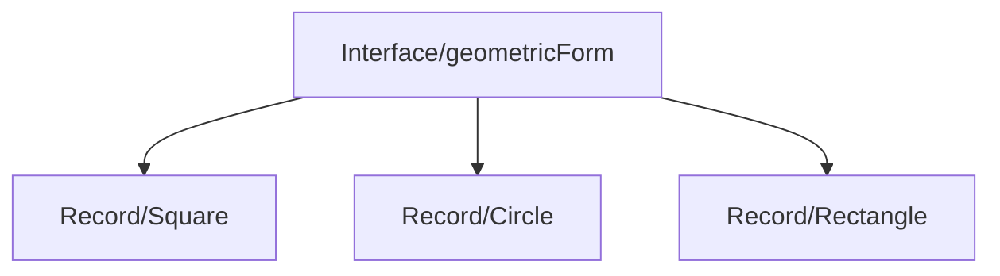

#  Exersise about Java Interface

[Linkedin Profile - Mathias Filype](www.linkedin.com/in/mathias-filype-366195246)
 
Student at [DIO](https://www.dio.me/) and [Faculdade Focus](https://faculdadefocus.com.br/)

##  General vision👨‍💻
| Description exersise | Topics covered |
|----------------------|----------------|
|Construction of a aplication for calc of area of geometric shape (Square, Circle and Rectangle) | Interface (creation of implematation in all the records) / Records (creation of characters for each geometric shape)|
---
## [Interface](https://www.datacamp.com/pt/doc/java/interface)
Create the interface for implementation the method getArea in the elements (Square, Circle and Rectangle)

## [Records](https://medium.com/@rleite.developer/desvendando-os-records-no-java-58086a729dbe)
``
1 -> Create for each geometric shape with its particularities
`` 
 
``
2 -> Implementing of @overide (anonymous class) 
``
 
``
3 - Implemening in principal class (main) =>
Creating of conditionals of implementing of records (squarem circle, rectangle) and interact with user.
Creating of methods for work with especific data of each record.
``

## Diagram for speficy the programming logic
``Interface -> Record``

